# Kütüphane Yönetim Sistemi (Library Management System)

Bu proje kullanıcıların kitapları inceleyip ödünç alabildiği, yöneticilerin ise envanteri ve kullanıcı işlemlerini takip edebildiği bir Kütüphane Yönetim Sistemi uygulamasıdır.

## Veritabanı Altyapısı

Proje veritabanı olarak Docker üzerinde çalışan bir PostgreSQL sunucusu kullanır


### Veritabanı Şeması (ERD)
Sistem temel olarak `users`, `books` ve `borrow_logs` tablolarından oluşmaktadır.

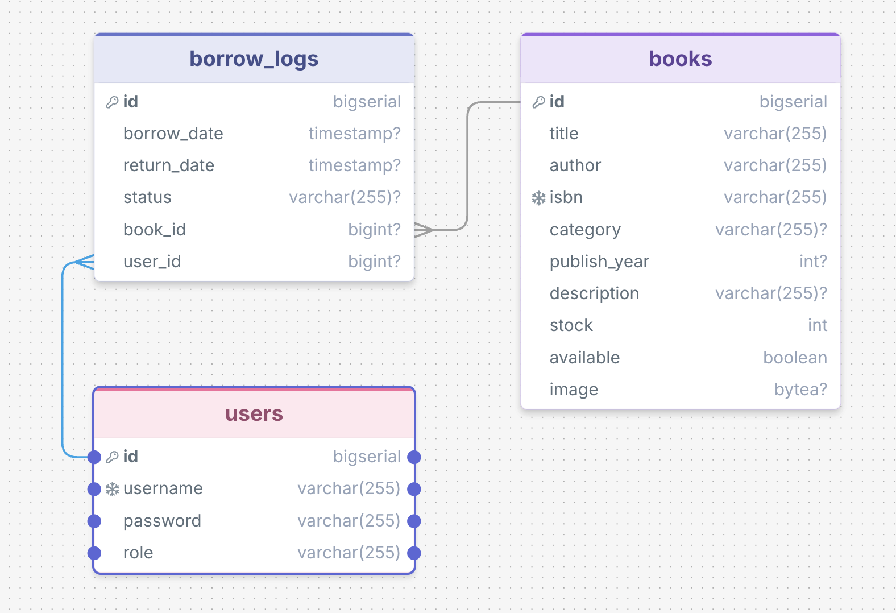

*Not: Uygulamaya yüklenen kitap görselleri `BYTEA` veri tipi ile BLOB olarak saklanmaktadır.*

## Sistem Özellikleri ve Kullanıcı Arayüzü

### 1. Kimlik Doğrulama ve Erişim Kontrolü
Sistemde yetkisiz erişimleri önlemek adına Spring Security filtresi uygulanmıştır. Ziyaretçiler yalnızca kitap listesini ve arama formunu görebilirken, işlem yapmak için giriş yapmaları gerekmektedir.

> **Teknik Detaylar:**
> * Güvenlik katmanı `SecurityConfig.java` sınıfında yapılandırılmış olup; `/admin/**` uç noktaları `ROLE_ADMIN` rolüne kısıtlanırken, ödünç alma gibi kritik işlemler için `isAuthenticated()` filtresi kullanılmıştır.
> * Kullanıcı parolaları veritabanına açık metin yerine `BCryptPasswordEncoder` ile hash'lenerek kaydedilir.
> * Kimlik doğrulama süreci, `CustomUserDetailsService` sınıfındaki `loadUserByUsername()` fonksiyonu ile `UserRepository.findByUsername()` sorgusunu kullanarak Spring Security'nin `UserDetails` objesini besler.

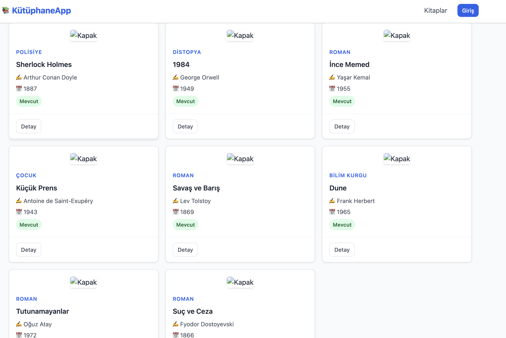
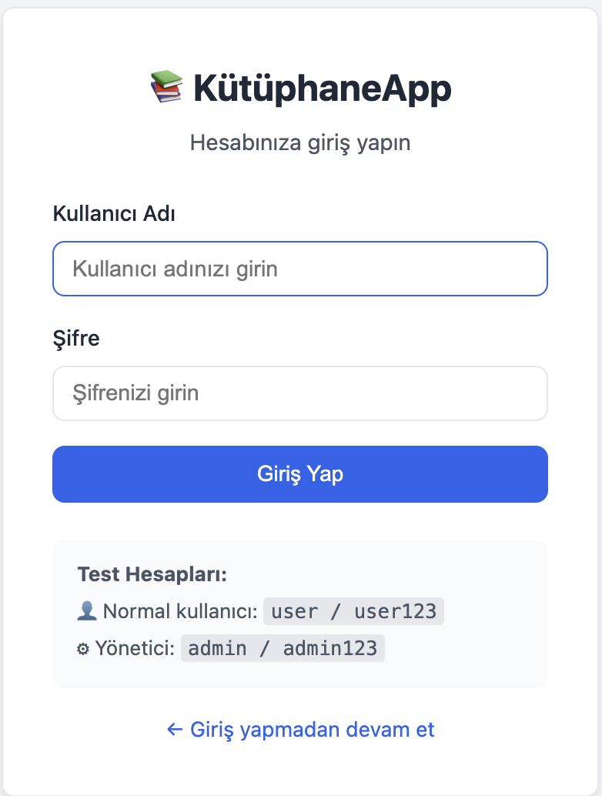

### 2. Kitap Kataloğu ve Detay Görünümü
Tüm kitaplar, kullanıcı dostu bir arayüz ile listelenmektedir. Her kitap kartı, dinamik stok durumunu (Mevcut / Stokta Yok) yansıtır.

> **Teknik Detaylar:**
> * Verilerin sunumu `BookController.java` içerisindeki `listBooks()` ve `bookDetail()` metotları ile koordine edilir.
> * Kitap arama işlemi, `BookRepository` arayüzüne yazılan özel bir `@Query` anotasyonlu JPQL fonksiyonu (`search`) ile başlık, yazar ve kategori sütunları üzerinde esnek biçimde çalışır.
> * Veritabanında byte formatında saklanan kitap görsellerini render etmek için `@GetMapping("/books/{id}/image")` uç noktası yazılmış ve veriler `ResponseEntity<byte[]>` (IMAGE_JPEG header'ı ile) olarak sayfadaki `` etiketlerine aktarılmıştır.

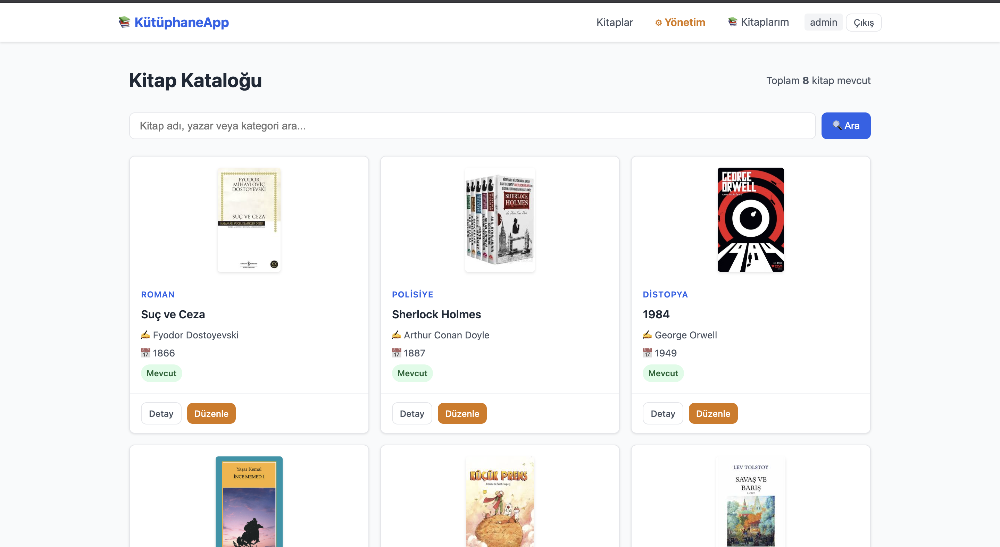


Detaylı inceleme ekranında kitabın yayın yılı, kategorisi, ISBN numarası ve açıklaması yer almaktadır.

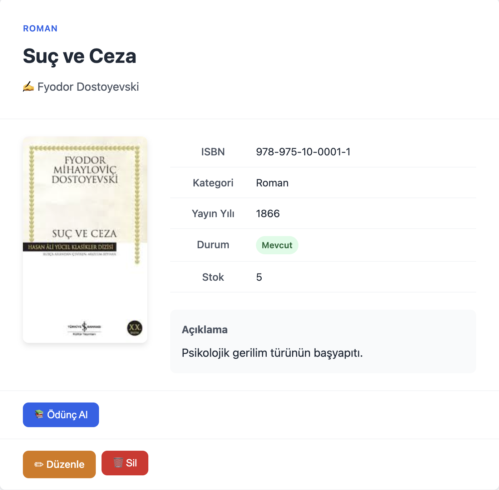

### 3. Ödünç Alma ve İade Süreçleri
Oturum açmış kullanıcılar, stokta bulunan kitapları "Ödünç Al" işlemi ile üzerlerine kaydedebilirler. Ödünç alma işlemi başarılı olduğunda stok sayısı atomik olarak düşürülür.

> **Teknik Detaylar:**
> * Ödünç alma ve iade etme akışları `BorrowService.java` üzerindeki `borrowBook()` ve `returnBook()` fonksiyonları ile işletilir.
> * Stok düşürme, log atma ve veritabanı senkronizasyonunda çıkabilecek olası hatalara (örn. işlemin yarıda kesilmesi) karşın veri tutarlılığını sağlamak için bu metotlar `@Transactional` anotasyonu ile sarmalanmıştır.
> * Kullanıcının "Kitaplarım" sayfasındaki özel geçmiş listesi, `BorrowLogRepository` içindeki `findByUserUsernameOrderByBorrowDateDesc()` metodu üzerinden sadece o an oturum açmış kullanıcı adına çekilerek `myBooks()` controller'ına iletilir.

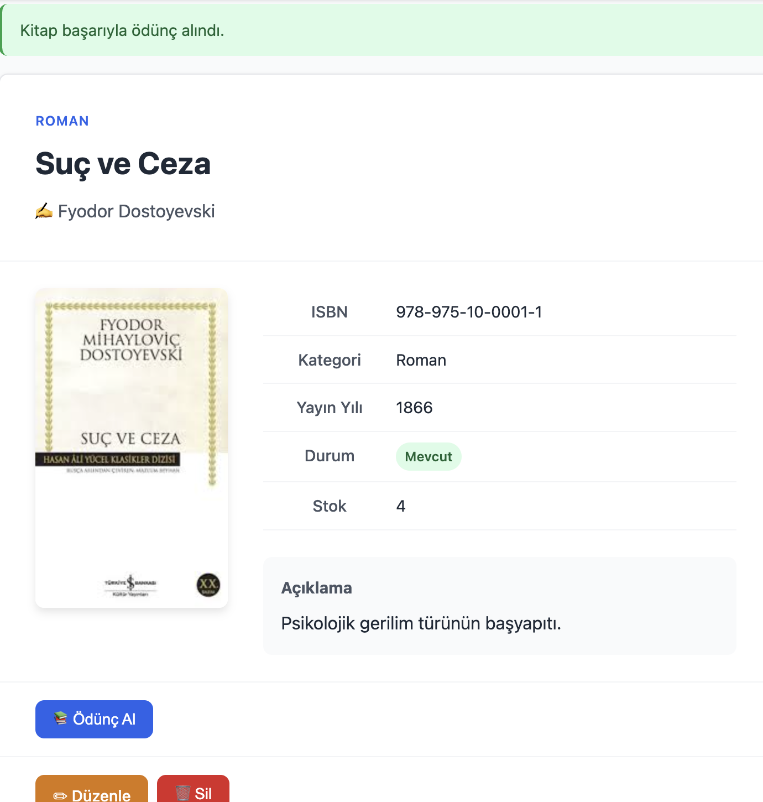

Kullanıcılar "Kitaplarım" sayfası üzerinden daha önce ödünç aldıkları kitapların listesini ve durumlarını görebilir, diledikleri zaman "İade Et" butonu ile kitapları sisteme geri kazandırabilirler.

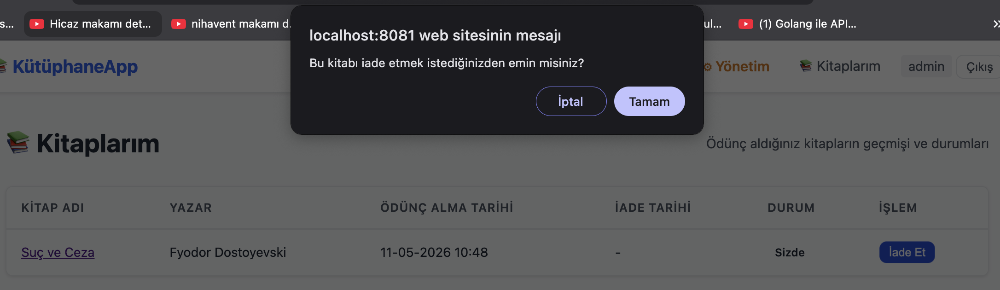
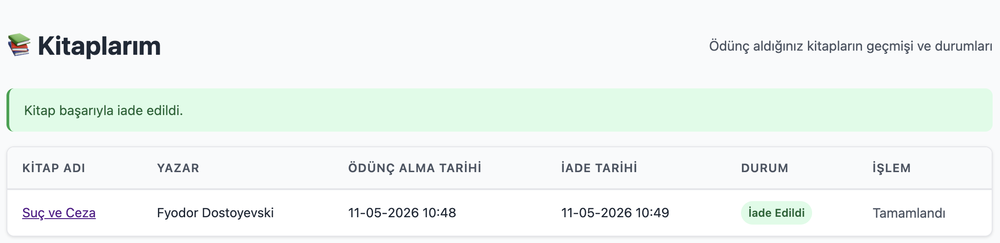

### 4. Yönetim Paneli (Admin Dashboard)
Yönetici yetkisine (`ROLE_ADMIN`) sahip kullanıcılar için özel bir gösterge paneli geliştirilmiştir. Bu panelde sistemin genel istatistikleri (toplam kitap, stok durumu, kullanıcı sayısı, aktif ödünç listesi) izlenebilmektedir.

> **Teknik Detaylar:**
> * Bu paneli yöneten tüm uç noktalar `AdminController.java` üzerinde toplanmış ve kök düzeyinde `@RequestMapping("/admin")` tanımlaması yapılmıştır.
> * Sistemdeki toplam kitap stoku gibi veriler for döngüleri yerine `BookRepository.sumStock()` JPQL komutuyla doğrudan veritabanı seviyesinde toplanarak performans kazanılmıştır.
> * Kitap eklendiğinde `saveBook()` metoduna bir `MultipartFile imageFile` objesi alınır. Dosyanın binary karşılığı `.getBytes()` fonksiyonu ile okunup doğrudan `Book` modelinin `image` propertysine atanır ve Spring Data JPA tarafından kaydedilir.

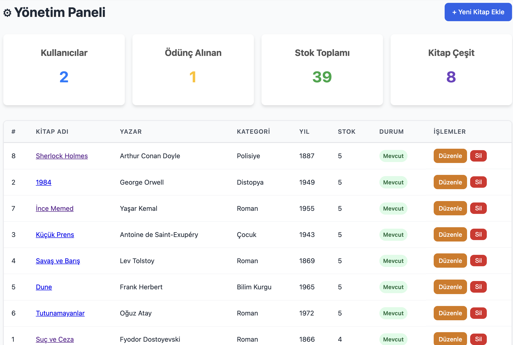

Yöneticiler sistemdeki kitapların stoklarını ve görsellerini güncelleyebilir veya yeni kitaplar ekleyebilir.

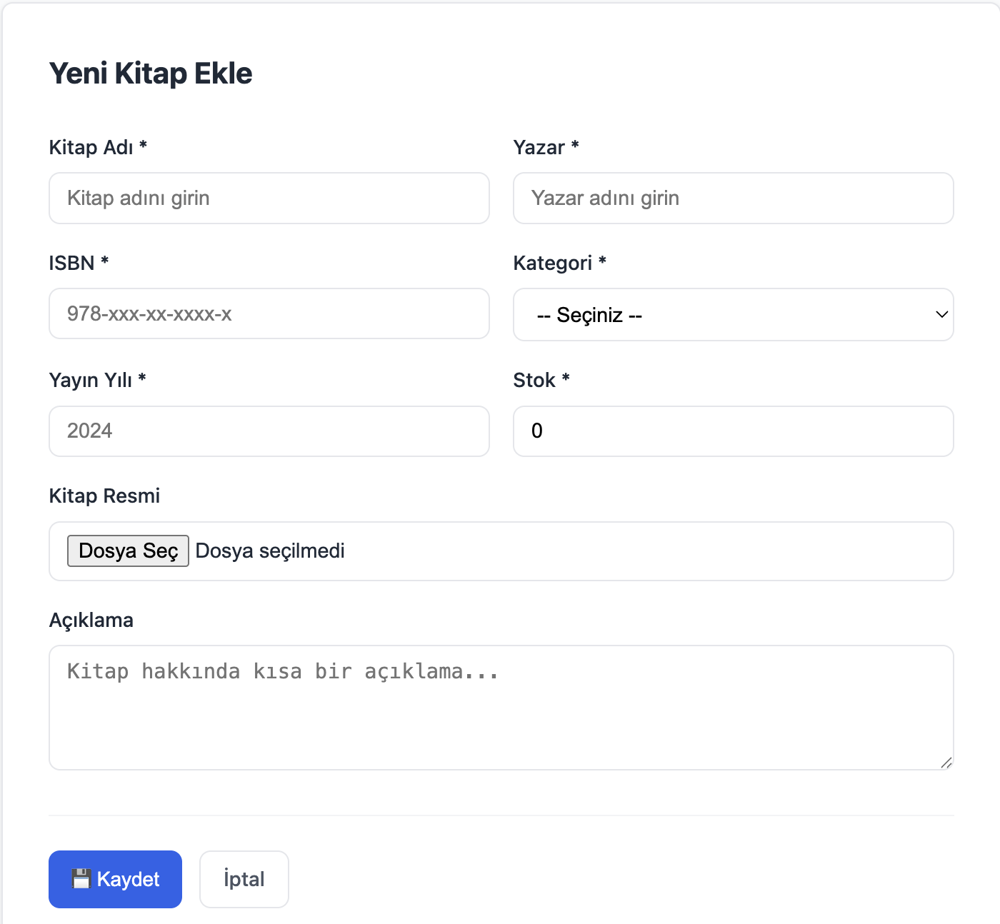
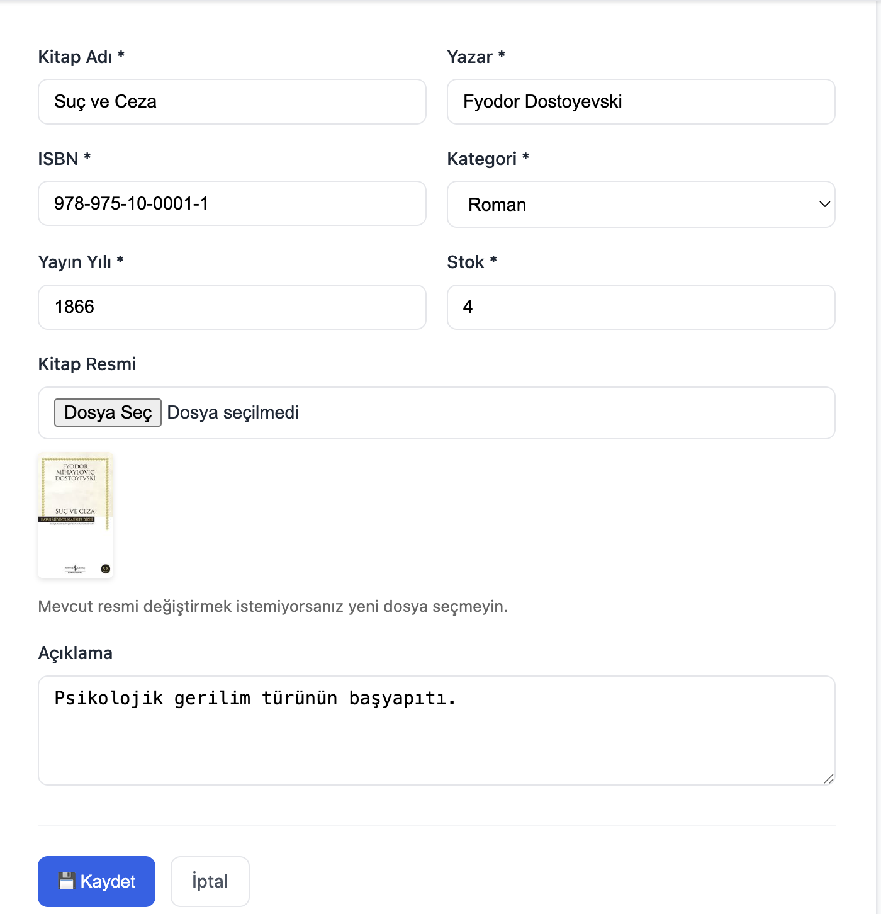

Tüm ödünç alma ve iade etme geçmişi, silinmeden `BorrowLog` tablosu üzerinde loglanarak yöneticinin takibine sunulmaktadır.

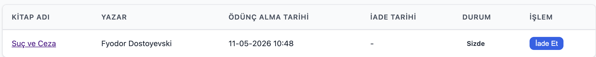

## Kurulum ve Çalıştırma

Projenin yerel ortamda çalıştırılabilmesi için bilgisayarınızda Java 17, Maven ve Docker kurulu olmalıdır.

1. PostgreSQL konteynerini başlatın:
   ```bash
   docker run --name library-postgres -e POSTGRES_PASSWORD=postgres -e POSTGRES_USER=postgres -e POSTGRES_DB=postgres -p 5432:5432 -d postgres:15
   ```
2. Proje dizininde terminali açıp uygulamayı derleyin ve çalıştırın:
   ```bash
   mvn clean spring-boot:run
   ```
3. Tarayıcınız üzerinden `http://localhost:8081` adresine giderek uygulamayı görüntüleyebilirsiniz. 

